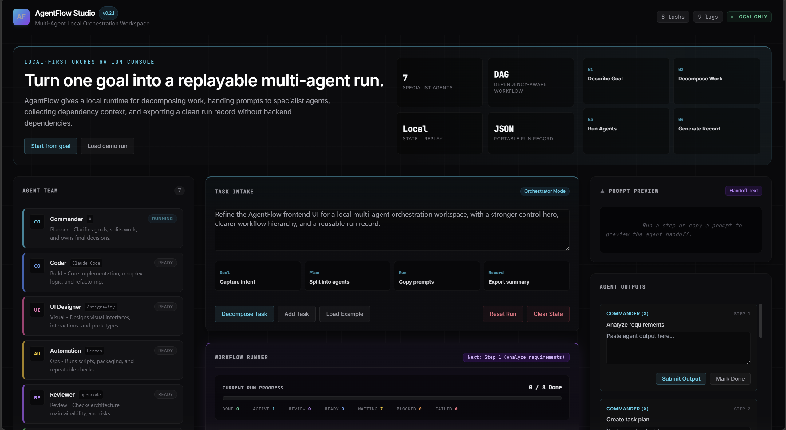
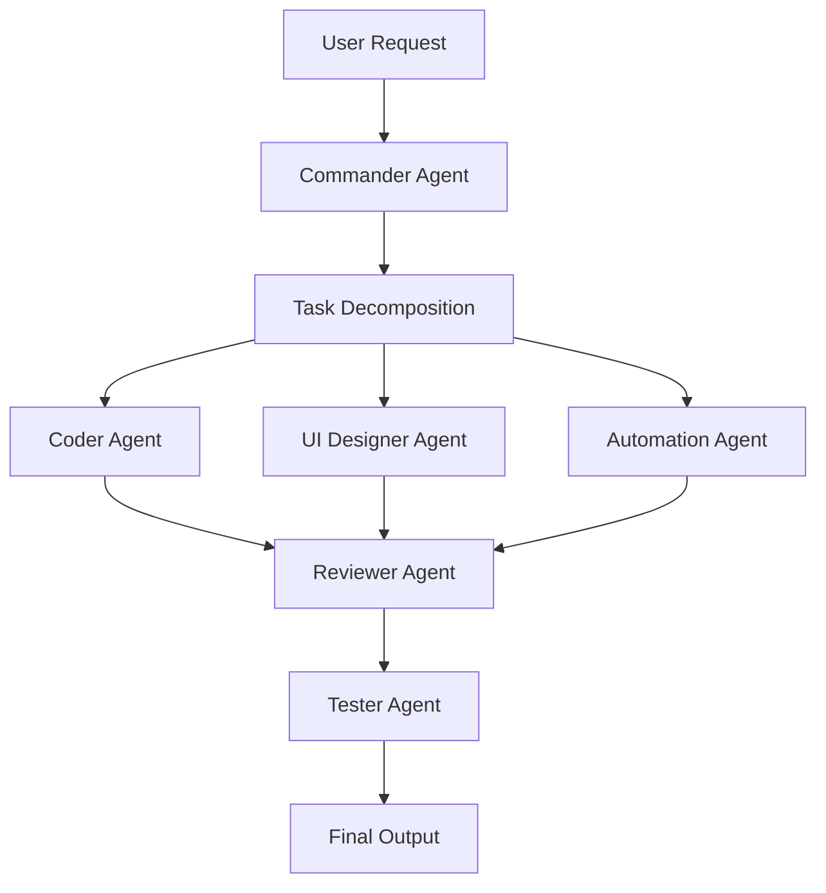

# AgentFlow

> **Open-source multi-agent orchestration workspace.**
> Turn multiple AI agents into a collaborative development team.

AgentFlow helps you coordinate multiple AI coding agents, automation agents, reviewers, and testers in a structured workflow. Instead of asking one model to do everything, AgentFlow decomposes complex tasks into subtasks and routes them to specialized agents — with a visual workspace so you can see what's happening.

> ⚠️ **Current status: v0.1.0** — static prototype. Open `index.html` in your browser to see the workspace concept. No backend, no API keys required. The full Next.js + FastAPI architecture is planned for later milestones. See [ROADMAP.md](./ROADMAP.md).

## Live Demo

**[dassin-alan.github.io/agentflow-studio](https://dassin-alan.github.io/agentflow-studio/)**

---

## Design Principles

AgentFlow follows a few simple principles:

- **Human-in-the-loop first** — users can manually route, inspect, and edit every step.
- **Protocol over platform** — agents should be replaceable through a portable schema.
- **Local-first MVP** — the first version runs without backend services or API keys.
- **Review before delivery** — generated outputs pass through review and QA steps.
- **Extensible by design** — workflows, agents, and adapters are configurable.

---

## Preview



---

## What You Can Do in the Demo

Open `index.html` and you can:

- 🎯 **View the Agent Team** — 7 agents with roles, icons, and capabilities
- ✍️ **Enter a task goal** — type your request or load the 3D Earth example
- 🔀 **Decompose tasks** — the Commander breaks your request into subtasks
- 📋 **Track the Task Board** — view subtasks across Planned, Active, and Review columns
- 📝 **Fill in Agent Outputs** — paste results from your real AI tools manually
- 📊 **Watch the Workflow Graph** — Mermaid diagram updates live
- 📜 **See the Collaboration Log** — every action is timestamped
- ✅ **Generate Final Output** — synthesize all results into Markdown
- 📋 **Copy / Export / Import** — save and restore run records

---

## Why AgentFlow?

Unlike single-agent workflows, AgentFlow treats AI tools as a **team**:

- **Commander Agent** — task planning, architecture design, and final decisions
- **Coder Agent** — core implementation, complex logic, refactoring
- **UI Designer Agent** — visual design, interaction, prototyping
- **Automation Agent** — scripts, command execution, workflow automation
- **Reviewer Agent** — architecture review, code quality, security, performance
- **Tester Agent** — test cases, bug reproduction, UX feedback, quality reports
- **Assistant Agent** — documentation, small fixes, routine tasks

Each agent has a defined role, a task protocol, and a place in the workflow. You stay in control — AgentFlow can work fully automatically or with human-in-the-loop checkpoints.

---

## Architecture



---

## Quick Start

```bash
git clone https://github.com/dassin-alan/agentflow-studio.git
cd agentflow-studio
open index.html        # macOS
# or
start index.html       # Windows
# or
xdg-open index.html    # Linux
```

That's it. No `npm install`, no `pip install`, no API keys. v0.1.0 is a self-contained static page.

> **Note:** v0.1.0 uses Tailwind CDN and Mermaid CDN for convenience. An internet connection is required for full styling and diagrams. A fully offline build will be introduced in a later version.

---

## Project Structure (v0.1.0)

```text
agentflow-studio/
├── index.html                # Static workspace demo ← START HERE
├── README.md
├── LICENSE
├── ROADMAP.md
├── CONTRIBUTING.md
├── CODE_OF_CONDUCT.md
├── SECURITY.md
├── .env.example
├── .gitignore
├── agents.yaml               # Agent role definitions
├── workflow.yaml             # Workflow step definitions
├── docs/                     # Documentation
│   ├── agent-protocol.md
│   ├── architecture.md
│   └── workflow.md
└── examples/                 # Example workflows
    ├── 3d-earth-demo/
    ├── code-review-workflow/
    └── docs-generation/
```

> `apps/` and `packages/` will appear in v0.2.0+. See [ROADMAP.md](./ROADMAP.md) for the planned structure.

---

## Configuration

AgentFlow uses YAML configuration for agents and workflows:

### agents.yaml

```yaml
agents:
  - id: commander
    name: Commander
    role: Task Planner
    description: Analyzes requirements, decomposes tasks, makes final decisions.

  - id: coder
    name: Coder
    role: Code Engineer
    description: Core implementation, complex logic, refactoring.
```

### workflow.yaml

```yaml
name: frontend_project_workflow
steps:
  - id: analyze
    agent: commander
    action: analyze_requirements
  - id: implement
    agent: coder
    action: generate_code
  - id: review
    agent: reviewer
    action: review_code
  - id: test
    agent: tester
    action: run_quality_check
```

---

## Roadmap

| Version | Goal | Status |
|---------|------|--------|
| v0.1.0 | Static demo — agent list, task board, mock workflow | 🟢 Active |
| v0.2.0 | Manual workflow — task CRUD, agent assignment, local storage | 📋 Planned |
| v0.3.0 | Agent Protocol — standardized task input/output schema | 📋 Planned |
| v0.4.0 | API integration — connect to real model backends | 📋 Planned |
| v0.5.0 | Review & test loop — automated code review and QA | 📋 Planned |
| v1.0.0 | Stable release — full visual workspace, plugin system | 📋 Planned |

See [ROADMAP.md](./ROADMAP.md) for details.

---

## Agent Protocol

AgentFlow defines a standard JSON protocol so any agent — regardless of model or provider — can participate in a workflow:

**Task Input:**
```json
{
  "id": "task-001",
  "title": "Build 3D Earth Website",
  "type": "frontend",
  "assigned_to": "coder",
  "status": "pending",
  "input": {
    "goal": "Create an interactive 3D Earth website",
    "constraints": ["single HTML file", "mouse rotation", "wheel zoom", "cyberpunk style"]
  },
  "expected_output": "HTML code"
}
```

**Task Output:**
```json
{
  "task_id": "task-001",
  "agent": "coder",
  "status": "completed",
  "output": "Generated code...",
  "issues": [],
  "next_steps": ["Send to reviewer", "Run visual QA"]
}
```

See [docs/agent-protocol.md](./docs/agent-protocol.md) for the full specification.

---

## Supported Agent Backends (Planned)

AgentFlow is provider-agnostic. Any model or tool that can accept JSON input and produce JSON output can be an agent:

- OpenAI-compatible API
- Anthropic (Claude) API
- DeepSeek API
- Gemini API
- Local LLM (Ollama, vLLM)
- Shell command agent
- Custom HTTP agent
- Manual agent (human-in-the-loop)

---

## Contributing

Contributions are welcome! See [CONTRIBUTING.md](./CONTRIBUTING.md) for guidelines.

For v0.1.0, the best ways to contribute are:
- Improving the static workspace UI
- Adding workflow examples
- Refining agent and workflow YAML configs
- Writing documentation

Good first issues are tagged with [`good first issue`](https://github.com/dassin-alan/agentflow-studio/labels/good%20first%20issue).

---

## License

[MIT](./LICENSE)

---

<p align="center">
  <b>AgentFlow</b> — Make AI agents work as a team.
</p>
