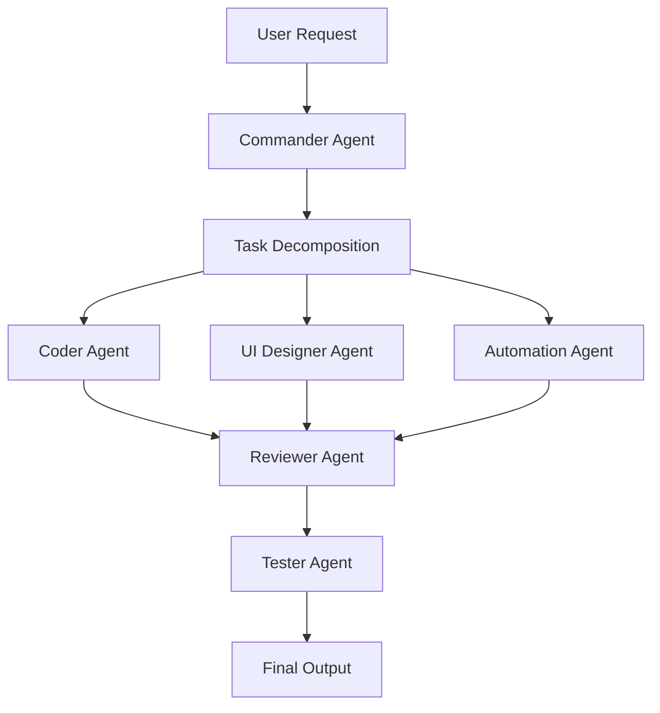

# AgentFlow Studio

AgentFlow Studio is an open-source, human-in-the-loop multi-agent orchestration workspace.

It helps developers turn a rough request into a traceable workflow:

- decompose one goal into agent-owned subtasks
- assign subtasks to specialized agent roles
- collect manual outputs from external AI tools
- generate a final markdown run record
- keep the first version runnable without backend setup

## Current Scope

This repository starts as a v0.1 static demo. It does not call model APIs yet.

The first useful version is deliberately small:

- local web workspace
- agent list
- task intake
- workflow graph
- task board
- collaboration log
- manual agent output fields
- markdown export
- `agents.yaml` and `workflow.yaml` examples

## Quick Start

Open this file in a browser:

```text
index.html
```

No install step is required for v0.1.

## Why This Exists

Most AI coding workflows still happen as loose copy-paste between tools. AgentFlow Studio focuses on the missing coordination layer:

- who should do which step
- what each agent received
- what each agent produced
- how review and test feedback are recorded
- what final output can be handed off

The project is not about binding users to one model. The long-term goal is a portable agent protocol and workflow engine.

## Architecture



## Repository Layout

```text
agentflow-studio/
├── index.html
├── README.md
├── ROADMAP.md
├── LICENSE
├── .gitignore
├── .env.example
├── docs/
│   └── agent-protocol.md
├── templates/
│   ├── agents.yaml
│   └── workflow.yaml
└── examples/
    └── 3d-earth-demo/
        └── workflow.yaml
```

## Roadmap

- v0.1 Static manual workspace
- v0.2 Local task persistence
- v0.3 Agent protocol schema
- v0.4 API agent adapters
- v0.5 Review and test loop
- v1.0 Stable open-source release

## License

MIT
