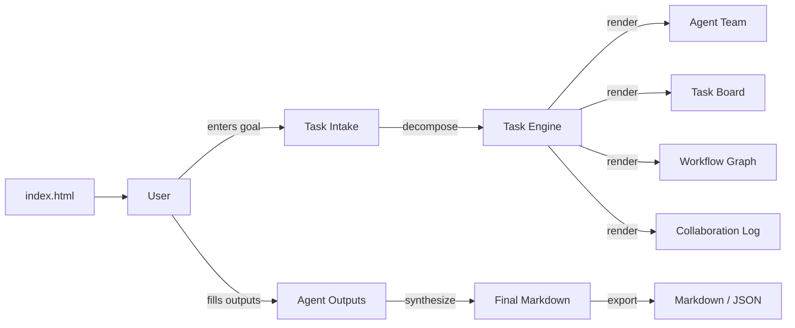
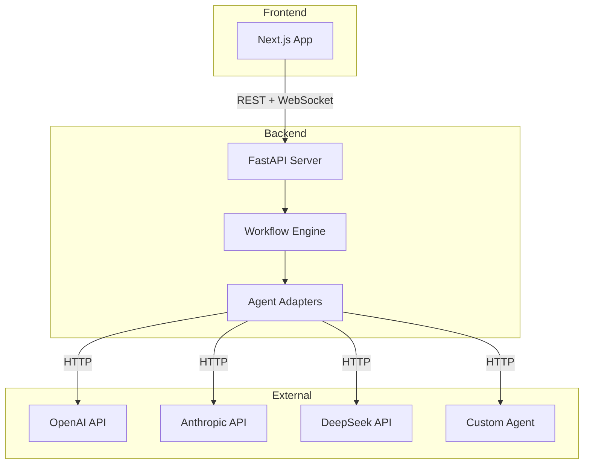

# Architecture

AgentFlow v0.1 is a single-file static workspace. This document describes the current architecture and the planned evolution.

---

## Current Architecture (v0.1.0)



### Key decisions for v0.1

- **Single HTML file, no build step.** Uses Tailwind CDN and Mermaid CDN loaded from `<script>` tags. No bundler, no framework, no package manager.
- **In-memory state.** All data (tasks, logs, agent outputs) lives in JavaScript objects. Refreshing the page resets everything — export JSON to persist.
- **Human-in-the-loop.** Every agent output is manually entered by the user. There is no API call to any model backend.
- **Mermaid for workflow visualization.** The workflow graph is rendered client-side from a generated Mermaid flowchart.

---

## Planned Architecture (v0.4.0+)



### Layers

| Layer | Technology | Purpose |
|-------|-----------|---------|
| **Presentation** | Next.js, React, Tailwind, React Flow | Visual workspace with drag-and-drop workflow editor |
| **API** | FastAPI, WebSocket, Pydantic | REST endpoints, real-time agent status streaming |
| **Workflow Engine** | Python, DAG executor | Task routing, dependency resolution, state machine |
| **Agent Adapters** | Plugins, HTTP clients | Translate Agent Protocol to provider-specific API calls |
| **Storage** | SQLite (dev) / PostgreSQL (prod) | Task history, run records, agent configs |

### Data Flow

```text
User Request → Commander (planning) → Task Decomposition → Agent Assignment
    → Agent Adapters (API calls) → Agent Outputs → Reviewer → Tester
    → Final Output → Export (Markdown, JSON, PDF)
```

---

## Agent Adapter Model (v0.4.0+)

```yaml
adapters:
  - type: openai-compatible
    config:
      base_url: https://api.openai.com/v1
      api_key_env: OPENAI_API_KEY

  - type: anthropic-compatible
    config:
      base_url: https://api.anthropic.com
      api_key_env: ANTHROPIC_API_KEY

  - type: custom-http
    config:
      endpoint: https://your-agent.example.com/execute
      api_key_env: CUSTOM_AGENT_API_KEY

  - type: shell
    config:
      command: "your-cli-tool --task '{input}'"
```

Each adapter translates the Agent Protocol's task input into the provider's format, sends the request, and normalizes the response back into the standard Agent Output format.

---

## Why This Architecture

- **Separation of concerns.** The workflow engine doesn't know about specific model APIs. Adapters handle that.
- **Protocol-first.** As long as an adapter speaks the Agent Protocol, it works.
- **Gradual migration.** v0.1's manual mode maps directly to the `handoff_mode: manual` field. When adapters arrive, changing one field upgrades the workflow.
- **Open-source friendly.** SQLite for zero-config dev. FastAPI for familiar Python tooling. Next.js for the React ecosystem.
